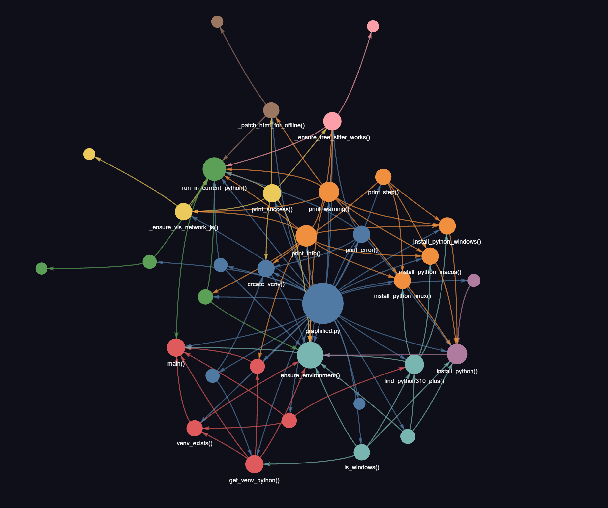

# graphified

<p align="center">
  
</p>

**Knowledge Graph Generator for Code Repositories**

A single-file, cross-platform CLI tool that generates knowledge graphs from any code repository. Zero-config, fail-safe, works everywhere.

## Features

- **Zero Configuration** - Just run and it works
- **Cross-Platform** - Windows, Linux, macOS
- **Auto Python Install** - Installs Python 3.10+ if not found
- **Isolated Environment** - Creates its own virtualenv
- **Incremental Updates** - SHA256 cache for fast re-runs
- **Multiple Outputs** - JSON, HTML, Markdown report
- **Token Efficient** - 90-95% token savings for AI agents
- **Offline Support** - Bundled vis-network.js for offline HTML visualization

## Quick Start

With Python >=3.10

```bash
python graphified.py /path/to/repo
```

That's it. The script handles everything else.

## Output

```
repo/
└── graphify-out/
    ├── graph.json       # Queryable knowledge graph
    ├── graph.html       # Interactive visualization
    ├── GRAPH_REPORT.md  # Analysis report
    └── cache/           # Incremental update cache (SHA256)
```

## Usage Examples

```bash
# Graph current directory
python graphified.py

# Graph specific repository
python graphified.py ~/projects/myapp

# Graph with AST-only extraction
python graphified.py ~/projects/myapp --ast-only
```

## What It Does

1. **Detects** all code, docs, papers, and images in the repo
2. **Extracts** AST structure from code files
3. **Builds** a knowledge graph with nodes and edges
4. **Clusters** into communities using Leiden algorithm
5. **Exports** to JSON, HTML, and Markdown

## Generated Files

### graph.json
Persistent knowledge graph for programmatic access. Use with GraphRAG or custom analysis.

### graph.html
Interactive visualization - open in any browser to explore the graph. Works offline with bundled vis-network.js.

### GRAPH_REPORT.md
Human-readable analysis including:
- God nodes (most connected components)
- Surprising connections
- Community structure

## AI Agent Integration

### Token Savings

| Approach | Tokens Used | Example |
|----------|-------------|---------|
| **Full Codebase** | ~50,000+ tokens | Reading all source files |
| **Knowledge Graph** | ~2,000 tokens | Reading `graph.json` summary |
| **Savings** | **90-95% reduction** | Massive context efficiency |

### How AI Agents Use the Graph

Instead of reading all source files, the agent:

```
1. Load graph.json → Understand structure, connections, communities (2K tokens)
2. Parse user query → Find relevant nodes in graph
3. Read ONLY specific files mentioned in those nodes (1-5K tokens)
4. Total: 3-7K tokens instead of 50K+
```

### Agent Workflow

```
┌─────────────────────────────────────────────────────────────┐
│                    AI Agent Workflow                        │
├─────────────────────────────────────────────────────────────┤
│  1. Check if graphify-out/graph.json exists                 │
│     ├── Yes → Load graph context (2K tokens)                │
│     └── No  → Run graphified.py first                       │
│                                                             │
│  2. Parse query and find relevant nodes in graph            │
│                                                             │
│  3. Read ONLY specific files mentioned in those nodes       │
│                                                             │
│  4. If user makes changes → Re-run graphified               │
│     (detects via file modification time or hash)            │
└─────────────────────────────────────────────────────────────┘
```

### Example: Querying the Graph

**User Query:** "How does the plotting system work?"

**Agent Process:**
1. Load `graph.json` (2K tokens)
2. Find relevant nodes: `PlotCanvas`, `PlotController`, `DataModel`
3. Read only those 3 files (4K tokens)
4. **Total: 6K tokens vs 50K+ for full codebase**

### Graph Context for Agent

The `graph.json` provides:

```json
{
  "nodes": [
    {"id": "DataModel", "type": "class", "file": "src/model/data_model.py", "connections": 72},
    {"id": "PlotCanvas", "type": "class", "file": "src/view/plot_canvas.py", "connections": 69}
  ],
  "edges": [
    {"source": "DataModel", "target": "PlotCanvas", "type": "uses"}
  ],
  "communities": {
    "0": ["DataModel", "CSVParser", "PandasTableModel"],
    "1": ["PlotCanvas", "PlotController", "ControlPanel"]
  }
}
```

### Files Required for Agent

| File | Purpose | Token Cost |
|------|---------|------------|
| `graph.json` | Full graph structure | ~2K tokens |
| `GRAPH_REPORT.md` | Human summary | ~1K tokens |
| Specific source files | Only when needed | ~1-5K tokens |

## When to Re-run graphified

| Change Type | Re-run? | Why |
|-------------|---------|-----|
| New files added | **Yes** | New nodes/edges needed |
| Functions/classes renamed | **Yes** | Node IDs change |
| Logic changes inside functions | **No** | Structure unchanged |
| Comments/docs updated | **No** | Not part of AST |
| Large refactoring | **Yes** | New relationships |

### Incremental Updates

Re-running is fast - only changed files are re-extracted:

```bash
# Uses cache/ folder with SHA256 hashes
python graphified.py /path/to/repo

# Only modified files are re-parsed
# Typical re-run: 5-10 seconds
```

## Requirements

- Python 3.10+ (auto-installed if missing)

The script will:
1. Check for Python 3.10+
2. If not found, attempt auto-install via winget/choco/brew/apt
3. Create isolated virtual environment
4. Install graphify dependency
5. Generate the knowledge graph

## Platform Support

| Platform | Package Manager | Auto-Install |
|----------|----------------|--------------|
| Windows | winget, choco | Yes |
| macOS | Homebrew | Yes |
| Ubuntu/Debian | apt | Yes |
| Fedora/RHEL | dnf | Yes |
| Arch | pacman | Yes |
| openSUSE | zypper | Yes |

## Integration

### VSCode Extension
Use the generated `graph.json` with Smart Agent for context-aware AI assistance.

### GraphRAG
Feed `graph.json` to RAG systems for semantic code search.

### CI/CD
Run on every commit to track codebase evolution:

```yaml
# GitHub Actions
- name: Generate Knowledge Graph
  run: python scripts/graphified/graphified.py .
```

## Troubleshooting

### Python not found
The script will attempt to install Python automatically. If it fails:
- **Windows**: `winget install Python.Python.3.12`
- **macOS**: `brew install python@3.12`
- **Linux**: `sudo apt install python3.12 python3.12-venv`

### Permission denied
On Linux/macOS, you may need sudo for system-wide Python installation.

### Large codebases
For repos with 200+ files or 2M+ words, consider running on subdirectories.

## License

MIT

## Credits

Powered by [graphify](https://github.com/pyshine/graphify)
